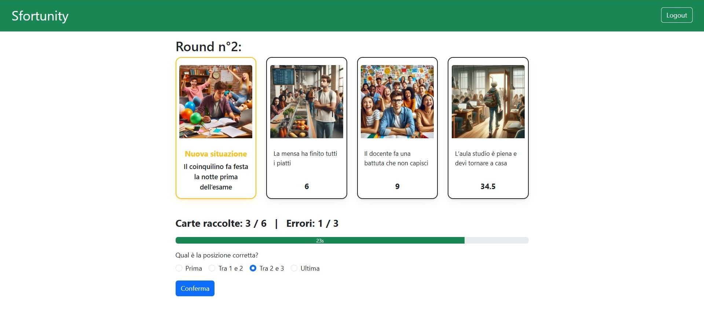
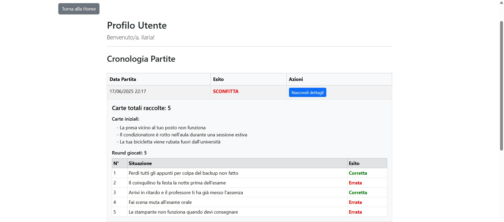

[](https://classroom.github.com/a/uNTgnFHD)
# Exam #1: "Gioco della Sfortuna"
## Student: s332008 SARCUNI ILARIA 

## React Client Application Routes

- Route `/`  
  **Contenuto:** Home page dell’applicazione web.  
  **Scopo:** Introduce il gioco e fornisce istruzioni all’utente. Presenta un pulsante per giocare una demo nel caso di utenti non autenticati e pulsanti per iniziare una nuova partita e visionare il proprio profilo utente nel caso si è autenticati.  
  **Accesso:** Pubblico (sia utenti autenticati che non autenticati).

- Route `/demo`  
  **Contenuto:** Pagina per la partita demo anonima.  
  **Scopo:** Permette di provare il gioco senza autenticazione, con una partita di esempio dalla durata di un round.  
  **Accesso:** Pubblico.

- Route `/game`  
  **Contenuto:** Pagina principale della partita.  
  **Scopo:** Gestione della partita dalla durata di più round.  
  **Accesso:** Solo utenti autenticati.  

- Route `/game/summary`  
  **Contenuto:** Riepilogo della partita appena conclusa.  
  **Scopo:** Mostra il risultato (vittoria/sconfitta), la data e le carte ottenute durante la partita conclusa.  
  **Accesso:** Solo utenti autenticati.  
  
- Route `/history`  
  **Contenuto:** Profilo utente con cronologia delle partite.  
  **Scopo:** Visualizza tutte le partite giocate dall’utente con i relativi dettagli.  
  **Accesso:** Solo utenti autenticati.  

- Route `/login`  
  **Contenuto:** Pagina di login.  
  **Scopo:** Permette l’autenticazione dell’utente tramite form.  
  **Accesso:** Pubblico. 

- Route `*`  
  **Contenuto:** Pagina di errore 404.  
  **Scopo:** Mostra un messaggio per rotte non esistenti.  
  **Accesso:** Pubblico.


## API Server
API HTTP progettate e implementate nel progetto.

### **Login**

**URL**: `/api/sessions`

**HTTP Method**: POST

**Descrizione**: autentica un utente e crea una nuova sessione

**Request body**: un oggetto JSON con le credenziali dell'utente
```json
{
  "email": "ilaria@polito.it",
  "password": "Ilaria00!"
}
```
**Risposta**: `201 Created` (successo), `401 Unauthorized` (credenziali errate), `500 Internal Server Error` (errore generico)

**Response body**: in caso di successo, restituisce un oggetto JSON con i dettagli dell'utente
```json
{
  "id": 1,
  "email": "ilaria@polito.it",
  "name": "Ilaria"
}
```

### **Ottenere la sessione corrente**

**URL**: `/api/sessions/current`

**HTTP Method**: GET

**Descrizione**: recupera le informazioni dell'utente attualmente autenticato

**Risposta**: `200 OK` (successo, utente loggato), `401 Unauthorized` (utente non loggato), `500 Internal Server Error` (errore generico)

**Response body**: in caso di successo, restituisce un oggetto JSON con i dettagli dell'utente
```json
{
  "id": 1,
  "email": "ilaria@polito.it",
  "name": "Ilaria"
}
```

### **Logout**

**URL**: `/api/sessions/current`

**HTTP Method**: DELETE

**Descrizione**: termina la sessione utente corrente

**Risposta**: `200 OK` (successo), `500 Internal Server Error` (errore generico)

**Response body**: _Nessuno_

---

### **Creare una nuova partita**

**URL**: `/api/game`

**HTTP Method**: POST

**Descrizione**: crea una nuova partita per l'utente autenticato

**Request body**: _Vuoto_

**Risposta**: `200 OK` (successo, con l'ID della partita creata), `500 Internal Server Error` (errore generico)

**Response body**: in caso di successo, restituisce l'ID della partita appena creata
```json
{ "game_id": 11 }
```

### **Ottenere 3 carte iniziali per una nuova partita (stateless)**

**URL**: `/api/game/init-cards`

**HTTP Method**: GET

**Descrizione**: recupera 3 carte casuali per una nuova partita

**Query Params**: `exclude` (opzionale) - una stringa di ID di carte da escludere durante i successivi round della partita

**Risposta**: `200 OK` (successo), `500 Internal Server Error` (errore generico)

**Response body**: Un array di tre oggetti 'card'.
```json
[
  {
    "card_id": 5,
    "description": "La stampante non funziona quando devi consegnare",
    "image": "stampante.jpg",
    "misfortune_index": 50.0
  },
  {
    "card_id": 12,
    "description": "Il relatore di tesi non risponde alle tue email",
    "image": "tesi.jpg",
    "misfortune_index": 77.0
  },
  {
    "card_id": 21,
    "description": "La macchinetta del caffè si mangia le monete",
    "image": "monete.jpg",
    "misfortune_index": 5.0
  }
]
```

### **Ottenere le carte iniziali di una partita (stateful)**

**URL**: `/api/game/:game_id/init-cards`

**HTTP Method**: GET

**Descrizione**: recupera le tre carte iniziali assegnate a una partita specifica

**Risposta**: `200 OK` (successo), `404 Not Found` (partita non esistente), `500 Internal Server Error` (errore generico).

**Response body**: Un array di tre oggetti 'card'
```json
[
  {
    "card_id": 5,
    "description": "La stampante non funziona quando devi consegnare",
    "image": "stampante.jpg",
    "misfortune_index": 50.0
  },
  {
    "card_id": 12,
    "description": "Il relatore di tesi non risponde alle tue email",
    "image": "tesi.jpg",
    "misfortune_index": 77.0
  },
  {
    "card_id": 21,
    "description": "La macchinetta del caffè si mangia le monete",
    "image": "monete.jpg",
    "misfortune_index": 5.0
  }
]
```

### **Salvare le carte iniziali di una partita**

**URL**: `/api/game/:game_id/init-cards`

**HTTP Method**: POST

**Descrizione**: salva le carte iniziali scelte per una partita

**Request body**: un oggetto JSON con gli ID delle carte
```json
{
  "card_ids": [5, 12, 21]
}
```
**Risposta**: `201 Created` (successo), `500 Internal Server Error` (errore generico)

**Response body**: _Nessuno_

### **Ottenere la carta della situazione corrente**

**URL**: `/api/game/:game_id/situation`

**HTTP Method**: GET

**Descrizione**: recupera la carta pe il round corrente di una partita

**Risposta**: `200 OK` (successo), `404 Not Found` (partita non esistente o nessuna carta disponibile), `500 Internal Server Error` (errore generico)

**Response body**: Un singolo oggetto 'card'.
```json
{
  "card_id": 28,
  "description": "La connessione Wi-Fi non funziona",
  "image": "wifi.jpg",
  "misfortune_index": 14.0
}
```

### **Creare un nuovo round**

**URL**: `/api/game/:game_id/round`

**HTTP Method**: POST

**Descrizione**: crea un nuovo round per una data partita

**Request body**: un oggetto JSON con i dettagli del round
```json
{
  "card_id": 28,
  "round_number": 1
}
```
**Risposta**: `200 OK` (successo, con l'ID del round creato), `500 Internal Server Error` (errore generico)

**Response body**: in caso di successo, restituisce l'ID del nuovo round
```json
{ "round_id": 31 }
```

### **Aggiornare un round**

**URL**: `/api/game/round/:round_id`

**HTTP Method**: PUT

**Descrizione**: aggiorna un round con la risposta dell'utente

**Request body**: un oggetto JSON con il risultato della risposta dell'utente
```json
{
  "guessed_correctly": 1,
  "chosen_position": 2
}
```
**Risposta**: `200 OK` (successo), `500 Internal Server Error` (errore generico)

**Response body**: _Nessuno_

### **Ottenere tutte le carte vinte in una partita**

**URL**: `/api/game/:game_id/won-cards`

**HTTP Method**: GET

**Descrizione**: recupera tutte le carte vinte in una partita specifica

**Risposta**: `200 OK` (successo), `500 Internal Server Error` (errore generico)

**Response body**: Un array di oggetti 'card'
```json
[
  {
    "card_id": 28,
    "description": "La connessione Wi-Fi non funziona",
    "image": "wifi.jpg",
    "misfortune_index": 14.0
  }
  ...
]
```

### **Ottenere la cronologia delle partite di un utente**

**URL**: `/api/game/user/:user_id`

**HTTP Method**: GET

**Descrizione**: recupera tutte le partite giocate da un utente specifico

**Risposta**: `200 OK` (successo), `403 Forbidden` (l'utente non è autorizzato), `500 Internal Server Error` (errore generico)

**Response body**: un array di oggetti 'game'.
```json
[
  {
    "game_id": 10,
    "user_id": 1,
    "date": "2025-06-16 23:34:08",
    "status": "win",
  },
  {
    "game_id": 11,
    "user_id": 1,
    "date": "2025-06-17 21:31:47",
    "status": "loss",
  }
]
```

### **Dettaglio cronologia di una partita**

**URL**: `/api/game/:game_id/history`

**HTTP Method**: GET

**Descrizione**: recupera la cronologia dettagliata di una partita specifica

**Risposta**: `200 OK` (successo), `500 Internal Server Error` (errore generico)

**Response body**: Un oggetto con i dettagli della cronologia della partita
```json
{
  "game_id": 11,
  "date": "2025-06-17 21:31:47",
  "status": "loss",

  "initial_cards": [
    {
      "card_id": 5,
      "description": "La stampante non funziona quando devi consegnare",
      "image": "stampante.jpg",
      "misfortune_index": 50.0
    },
    ...
  ],
  
  "rounds": [
    {
      "round_number": 1,
      "guessed_correctly": 1,
      "chosen_position": 2,
      "card": {
        "card_id": 48,
        "description": "Durante una lezione online si attiva per sbaglio il microfono mentre stai dicendo qualcosa di compromettente",
        "image": "microfono.jpg",
        "misfortune_index": 65.5
      }
    },
    ...
  ]
}
```

### **Aggiornare lo stato di una partita**

**URL**: `/api/game/:game_id/status`

**HTTP Method**: PUT

**Descrizione**: aggiorna lo stato di una partita (win/lose)

**Request body**: un oggetto JSON con il nuovo stato.
```json
{
  "status": "win"
}
```
**Risposta**: `200 OK` (successo), `500 Internal Server Error` (errore generico)

**Response body**: _Nessuno_

### **Ottenere i dati di una singola partita**

**URL**: `/api/game/:game_id`

**HTTP Method**: GET

**Descrizione**: recupera i dati riassuntivi di una singola **partita**.

**Risposta**: `200 OK` (successo), `404 Not Found` (partita non trovata), `500 Internal Server Error` (errore generico).

**Response body**: Un oggetto **partita**.
```json
{
  "game_id": 11,
  "user_id": 1,
  "date": "2025-06-17 21:31:47",
  "status": "loss",
}
```
---

### **Ottenere i dati per la partita demo**

**URL**: `/api/demo`

**HTTP Method**: GET

**Descrizione**: recupera i dati necessari per avviare una sessione di gioco demo

**Risposta**: `200 OK` (successo), `500 Internal Server Error` (errore generico)

**Response body**: un oggetto JSON contenente tre carte iniziali e una nuova carta situazione
```json
{
  "initialCards": [
    {
      "card_id": 5,
      "description": "La stampante non funziona quando devi consegnare",
      "image": "stampante.jpg",
      "misfortune_index": 50.0
    },
    ...
  ],
  "card": {
    "card_id": 8,
    "description": "Ti si scarica il PC durante un esame",
    "image": "pc.jpg",
    "misfortune_index": 75.0
  }
}
```

## Test

Per una raccolta di esempi pronti di richieste HTTP consulta il file **test.http** incluso nel progetto.

## Database Tables
Le informazioni sono salvate in un database SQlite (`stuffhappens.sqlite`).

- **Tabella `users`**  
  Contiene gli utenti registrati al sistema.
  - `user_id`: identificativo univoco dell’utente (PK)
  - `email`: email univoca dell’utente
  - `name`: nome dell’utente
  - `hash`: hash della password
  - `salt`: salt usato per la cifratura della password

---

- **Tabella `cards`**  
  Contiene tutte le carte disponibili nel gioco.
  - `card_id`: identificativo univoco della carta (PK)
  - `description`: descrizione della situazione
  - `image`: nome file immagine associato
  - `misfortune_index`: indice di sfortuna della carta

---

- **Tabella `games`**  
  Rappresenta una partita giocata da un utente.
  - `game_id`: identificativo univoco della partita (PK)
  - `user_id`: utente che ha creato la partita (FK su `users`)
  - `date`: data/ora di creazione della partita
  - `status`: stato della partita (`win`/`lose`)

---

- **Tabella `initial_game_cards`**  
  Tiene traccia delle carte iniziali assegnate a ogni partita.
  - `id`: identificativo univoco della riga (PK)
  - `game_id`: partita a cui si riferiscono le carte (FK su `games`)
  - `card_id`: carta associata (FK su `cards`)

---

- **Tabella `rounds`**  
  Registra ogni round giocato in ogni partita.
  - `round_id`: identificativo univoco del round (PK)
  - `game_id`: partita a cui appartiene il round (FK su `games`)
  - `card_id`: carta da indovinare mostrata in quel round (FK su `cards`)
  - `round_number`: numero del round nella partita
  - `guessed_correctly`: 1 se la risposta dell’utente è corretta, 0 altrimenti
  - `chosen_position`: posizione scelta dall’utente (può essere `NULL`)
  - `time`: data/ora del round

---

## Main React Components

- `LoginForm`, `LogoutButton` (in `AuthPage.jsx`): – Gestione autenticazione utente (login/logout)

- `DemoGame` (in `DemoGame.jsx`) – Partita demo anonima  

- `GamePage` (in `GamePage.jsx`) – Pagina principale della partita

- `GameSummary` (in `GameSummary.jsx`) – Riepilogo della partita appena giocata

- `HomePage` (in `HomePage.jsx`) – Schermata iniziale con istruzioni del gioco

- `LayoutPage` (in `LayoutPage.jsx`) – Layout comune dell'applicazione

- `NavHeader` (in `NavHeader.jsx`) – Barra di navigazione in alto

- `NotFound` (in `NotFound.jsx`) – Pagina di errore 404 per rotte non trovate

- `UserHistory` (in `UserHistory.jsx`) – Cronologia partite dell’utente

## Screenshot

- **Schermata partita in corso:** 

  

- **Schermata cronologia utente:**  

  

## Users Credentials

- username `ilaria@polito.it`, password `Ilaria00!`
- username `francesca@polito.it`, password `Francesca02!`
- username `roberta@polito.it`, password `Roberta07!`
